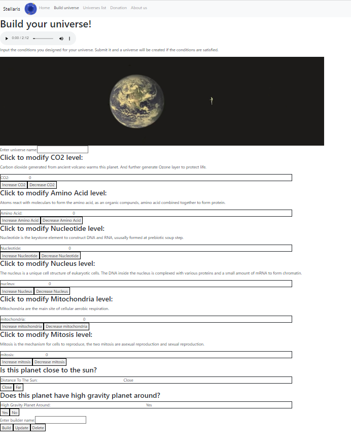
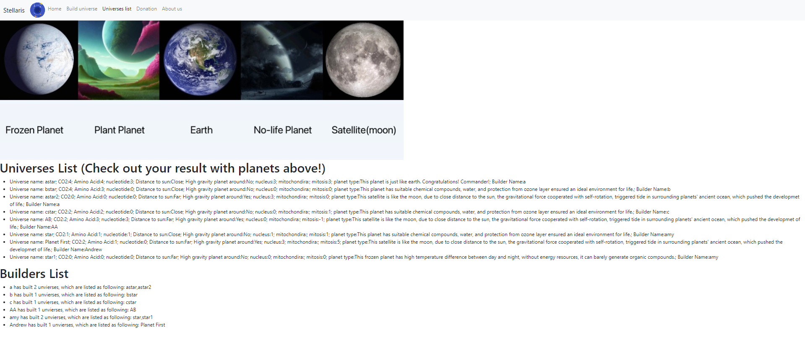

# CS5610Project3
100% finished on 11/22/2022.
# Stellaris
Public deployment link: [https://stellaris3.herokuapp.com/](https://stellaris3.herokuapp.com/)

Authors: [Yuting Shao](https://Yuting-Shao.github.io), [Zihan Xu](https://personal-web.hro1.repl.co/)
​
This is the Project 3 of the class CS5610 - web development 2022 Fall.
Class Link: [NEU CS5610 - Web Development 2022 Fall](https://johnguerra.co/classes/webDevelopment_fall_2022/)
​

This web app is designed for nature science researchers to simulate the growth of a planet. This app allows users to manipulate different features of an original planet (like earth 4.5 billion years ago) to see how nature environment and civilization on a planet grow, iterate, maintain and decay.

In 2077, human has explored all planets in Oort cloud. They owned the technology to manage a global ecosystem of a just explored planet. 
  United Nation wonder if we can simulate the operation result of exploiting a given planet.
  Therefore, they hired 79 years old computer science masters Zihan and Yuting from Northeastern University to design a simulator web with react, mongoDB and all required functions from professor John.

## Main Page

## Build Page

## List Page

## [Design Document](./designDocument.pdf)
https://docs.google.com/document/d/1UrfzKYX_RX7uPp5tDl5UNgDZotgqc9ELaskE__9Kng8/edit?usp=sharing

## [Project Slides](https://docs.google.com/presentation/d/e/2PACX-1vQ74RQ74XOvh9MkSVgxT38rJ2b-JhrREyQ2Legh-ZI901iHzRrPXoKQv_Mz9yrdf-5J3ZF_AJuYYoB_/pub?start=false&loop=true&delayms=10000&slide=id.g19d58c955c6_0_0)
https://docs.google.com/presentation/d/e/2PACX-1vQ74RQ74XOvh9MkSVgxT38rJ2b-JhrREyQ2Legh-ZI901iHzRrPXoKQv_Mz9yrdf-5J3ZF_AJuYYoB_/pub?start=false&loop=true&delayms=10000&slide=id.g19d58c955c6_0_0

## Videos
[Zihan Xu](https://www.youtube.com/watch?v=-DngOj8KNOg): https://www.youtube.com/watch?v=-DngOj8KNOg

[Yuting Shao](https://youtu.be/7AV_L0FqmQI): https://youtu.be/7AV_L0FqmQI

## Figma Logic Graph
link:https://www.figma.com/file/GAkvCtfFyx7a0HpIPUqqtv/Diagram---Untitled?node-id=117%3A547&t=umEc2V4evcThNRmK-1

# Instructions to build:
1. Install node.js
2. In the root folder of the project: npm install
3. In the root folder of the project: npm start