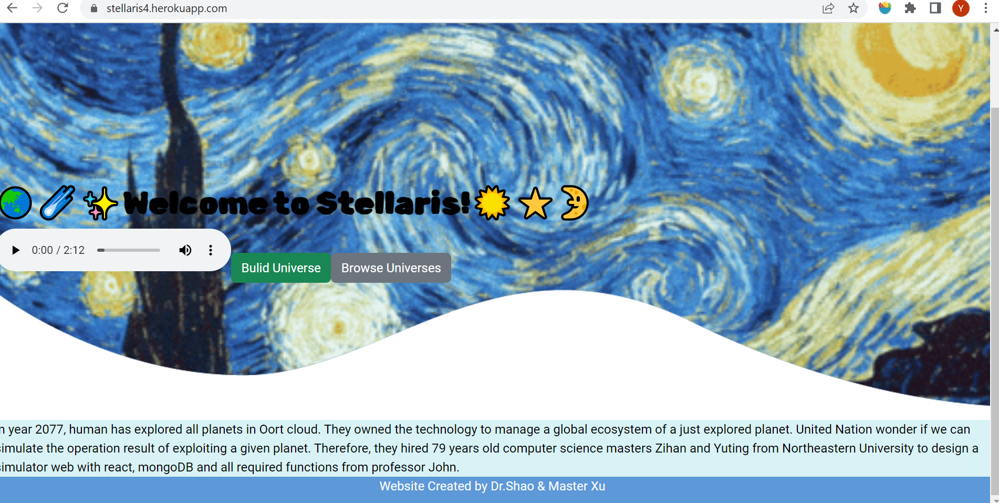

# CS5610Project4
# Stellaris
Project 4 Public deployment link: [https://stellaris4.herokuapp.com/](https://stellaris4.herokuapp.com/)

Project 3 100% finished on 11/22/2022.

Project3 release: [https://github.com/Yuting-Shao/CS5610Project3/releases/tag/project3](https://github.com/Yuting-Shao/CS5610Project3/releases/tag/project3)

Project 3 Public deployment link: [https://stellaris3.herokuapp.com/](https://stellaris3.herokuapp.com/)

## Improvement lists
### 1. Add google fonts and color palette to the web app
#### Google fonts used
**'[Roboto, sans-serif](https://fonts.google.com/specimen/Roboto)'** is used for the body texts. **'[Rubik Spray Paint, cursive](https://fonts.google.com/specimen/Rubik+Spray+Paint)'** is used for the head titles.

#### Color palette

### 2. Add pagination and search bar to the list page
#### Previous

#### Now

#### Previous

#### Now

### 3. Redesign the build page and buttons
#### Previous

#### Now

#### Previous

#### Now

#### Previous

#### Now

### 4. Add two buttons to the home page
#### Previous

#### Now

Authors: [Yuting Shao](https://Yuting-Shao.github.io), [Zihan Xu](https://personal-web.hro1.repl.co/)
​

This is the Final Project of the class CS5610 - web development 2022 Fall.
Class Link: [NEU CS5610 - Web Development 2022 Fall](https://johnguerra.co/classes/webDevelopment_fall_2022/)
​

This web app is designed for nature science researchers to simulate the growth of a planet. This app allows users to manipulate different features of an original planet (like earth 4.5 billion years ago) to see how nature environment and civilization on a planet grow, iterate, maintain and decay.

In 2077, human has explored all planets in Oort cloud. They owned the technology to manage a global ecosystem of a just explored planet. 
  United Nation wonder if we can simulate the operation result of exploiting a given planet.
  Therefore, they hired 79 years old computer science masters Zihan and Yuting from Northeastern University to design a simulator web with react, mongoDB and all required functions from professor John.

## [Design Document](./designDocument.pdf)
https://docs.google.com/document/d/1UrfzKYX_RX7uPp5tDl5UNgDZotgqc9ELaskE__9Kng8/edit?usp=sharing

## [Project Slides]
https://docs.google.com/presentation/d/1b5j4tGkUPVBaHM5SFqJBxhxNP5XsPNe54VpQO6yKC7I/edit?usp=sharing

## Usability Study Report
[Usability Study Report](./screenshots/UsabilityStudyReport.pdf)

## Videos
[Zihan Xu](https://youtu.be/_u6-m1I-IJY): https://youtu.be/_u6-m1I-IJY

[Yuting Shao](https://youtu.be/7AV_L0FqmQI): https://youtu.be/7AV_L0FqmQI

## Figma Logic Graph
link:https://www.figma.com/file/GAkvCtfFyx7a0HpIPUqqtv/Diagram---Untitled?node-id=117%3A547&t=umEc2V4evcThNRmK-1

# Instructions to build:
1. Install node.js
2. In the root folder of the project: npm install
3. In the root folder of the project: npm start
